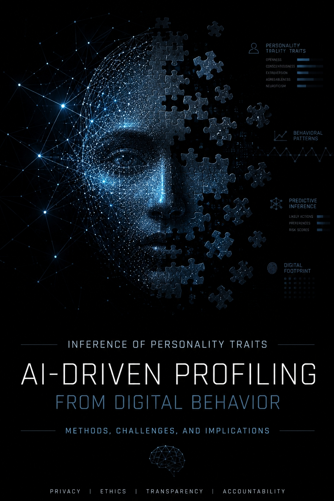

# حریم خصوصی در عصر هوش مصنوعی

## ظهور پروفایل‌سازی و پروفایل‌سازی سایه

### چه چیزهایی را نباید با هوش مصنوعی مطرح کنیم و چرا خطر واقعی بزرگ‌تر از چیزی است که فکر می‌کنیم

---

## فهرست مطالب

1. [مقدمه](#مقدمه)
2. [اولین اشتباه: تصور اینکه حریم خصوصی فقط درباره داده‌های محرمانه است](#اولین-اشتباه-تصور-اینکه-حریم-خصوصی-فقط-درباره-دادههای-محرمانه-است)
3. [چه چیزهایی را نباید با هیچ هوش مصنوعی مطرح کرد؟](#چه-چیزهایی-را-نباید-با-هیچ-هوش-مصنوعی-مطرح-کرد)
4. [هوش مصنوعی ابری یا محلی؟](#هوش-مصنوعی-ابری-یا-محلی)
5. [نظریه پازل](#نظریه-پازل)
6. [پروفایل‌سازی](#پروفایلسازی)
7. [پروفایل‌سازی سایه](#پروفایلسازی-سایه)
8. [چرا هوش مصنوعی همه‌چیز را تغییر می‌دهد؟](#چرا-هوش-مصنوعی-همهچیز-را-تغییر-میدهد)
9. [پروفایل‌سازی فقط یک نظریه نیست](#پروفایلسازی-فقط-یک-نظریه-نیست)
10. [یک مثال تاریخی](#یک-مثال-تاریخی)
11. [تفاوت میان داده و هوشمندی](#تفاوت-میان-داده-و-هوشمندی)
12. [مسئله جدید حریم خصوصی](#مسئله-جدید-حریم-خصوصی)
13. [چرا گفتگوهای طولانی اهمیت دارند؟](#چرا-گفتگوهای-طولانی-اهمیت-دارند)
14. [پروفایلی که هرگز قصد ساختنش را نداشتید](#پروفایلی-که-هرگز-قصد-ساختنش-را-نداشتید)
15. [ارزش پنهان گفتگوهای هوش مصنوعی](#ارزش-پنهان-گفتگوهای-هوش-مصنوعی)
16. [اقتصاد داده‌های رفتاری](#اقتصاد-دادههای-رفتاری)
17. [چه چیزهایی نسبتاً امن‌تر هستند؟](#چه-چیزهایی-نسبتاً-امنتر-هستند)
18. [یک سؤال بهتر درباره حریم خصوصی](#یک-سؤال-بهتر-درباره-حریم-خصوصی)
19. [آیا در یک نقطه عطف تاریخی قرار داریم؟](#آیا-در-یک-نقطه-عطف-تاریخی-قرار-داریم)
20. [نقش ما چیست؟](#نقش-ما-چیست)
21. [یادداشت نویسنده: یک پارادوکس کوچک](#یادداشت-نویسنده-یک-پارادوکس-کوچک)
22. [سخن پایانی](#سخن-پایانی)
23. [گفتگو](#گفتگو)
24. [مجوز انتشار](#مجوز-انتشار)

---

## مقدمه

بیشتر مطالبی که درباره حریم خصوصی و هوش مصنوعی نوشته می‌شوند، با چند توصیه آشنا شروع می‌شوند:

* رمز عبور خود را به هوش مصنوعی ندهید.
* اطلاعات کارت بانکی خود را وارد نکنید.
* فایل‌های محرمانه را بارگذاری نکنید.

همه این توصیه‌ها درست هستند.

اما یک مشکل وجود دارد.

این توصیه‌ها فقط بخش کوچکی از ماجرا را پوشش می‌دهند.

خطر اصلی اغلب اطلاعاتی نیست که آگاهانه در اختیار هوش مصنوعی قرار می‌دهیم.

خطر اصلی، اطلاعاتی است که از کنار هم قرار گرفتن داده‌های ظاهراً بی‌اهمیت درباره ما استخراج می‌شود.

بیشتر مردم تصور می‌کنند حریم خصوصی یعنی پنهان کردن رازها.

اما در دنیای امروز، حریم خصوصی بیش از هر زمان دیگری به کنترل الگوهایی مربوط می‌شود که از اطلاعات ما شکل می‌گیرند.

این تفاوت بسیار مهم است.

رمز عبور یک راز است.

اما پروفایل شخصیتی یک الگو است.

آدرس خانه یک راز است.

اما مدلی که بتواند حدس بزند شما در آینده کجا زندگی خواهید کرد، یک الگو است.

پرونده پزشکی یک راز است.

اما مدلی که بتواند احتمال ابتلا به یک بیماری را پیش‌بینی کند، یک الگو است.

و شاید مهم‌ترین مهارت عصر هوش مصنوعی، درک همین تفاوت باشد.

---

# اولین اشتباه: تصور اینکه حریم خصوصی فقط درباره داده‌های محرمانه است

اگر از اکثر افراد بپرسید:

«بزرگ‌ترین نگرانی شما درباره حریم خصوصی در هوش مصنوعی چیست؟»

احتمالاً پاسخ‌هایی مانند این خواهید شنید:

* رمز عبور
* اطلاعات بانکی
* اسناد محرمانه
* کلیدهای API

اما سیستم‌های هوشمند مدرن اغلب به چیزی بسیار ارزشمندتر علاقه دارند:

**پروفایل شما.**

زیرا پروفایل‌ها امکان پیش‌بینی رفتار را فراهم می‌کنند.

و در دنیای فناوری، تبلیغات، تجارت و حتی سیاست، توانایی پیش‌بینی رفتار انسان همیشه یکی از ارزشمندترین دارایی‌ها بوده است.

دانستن اینکه فردا چه خواهید کرد، گاهی ارزشمندتر از دانستن این است که دیروز چه کرده‌اید.

---

# چه چیزهایی را نباید با هیچ هوش مصنوعی مطرح کرد؟

فرقی نمی‌کند از یک مدل ابری استفاده می‌کنید یا یک مدل کاملاً محلی.

برخی اطلاعات باید همیشه با احتیاط بسیار بالا مدیریت شوند.

## اطلاعات دسترسی

هرگز موارد زیر را ارسال نکنید:

* رمز عبور
* API Key
* توکن‌های احراز هویت
* کدهای بازیابی
* کلیدهای SSH
* گواهی‌های خصوصی

نشت یکی از این موارد می‌تواند کل یک سامانه را به خطر بیندازد.

---

## داده‌های مشتریان

از ارسال این موارد خودداری کنید:

* اطلاعات کاربران
* دیتابیس مشتریان
* خروجی‌های سیستم
* داده‌های شخصی

حتی اگر نام افراد حذف شده باشد، گاهی امکان شناسایی مجدد آن‌ها وجود دارد.

---

## اطلاعات حساس دیگران

* پرونده‌های پزشکی
* مکالمات خصوصی
* اختلافات حقوقی
* مذاکرات محرمانه
* گفتگوهای داخلی سازمان‌ها

حریم خصوصی دیگران همچنان متعلق به آن‌هاست، حتی زمانی که هوش مصنوعی در میان باشد.

---

## زیرساخت‌های عملیاتی

هرگز موارد زیر را بارگذاری نکنید:

* فایل‌های Environment
* تنظیمات Production
* نقشه شبکه داخلی
* جزئیات معماری امنیتی

گاهی ارزش این اطلاعات از خود سورس‌کد بیشتر است.

---

# هوش مصنوعی ابری یا محلی؟

یکی از رایج‌ترین تصورات اشتباه این است:

«اگر مدل را روی کامپیوتر خودم اجرا کنم، مشکل حریم خصوصی حل می‌شود.»

واقعیت پیچیده‌تر است.

---

## هوش مصنوعی ابری

مزایا:

* مدل‌های بزرگ‌تر
* توانایی بیشتر
* به‌روزرسانی مداوم
* کیفیت خروجی بهتر

ریسک‌ها:

* خروج داده از دستگاه شما
* وابستگی به زیرساخت شخص ثالث
* تغییر احتمالی سیاست‌ها در آینده

---

## هوش مصنوعی محلی

مزایا:

* کنترل بیشتر
* کاهش وابستگی به سرویس‌دهندگان
* مالکیت بهتر روی داده‌ها

ریسک‌ها:

* آلودگی دستگاه
* بدافزار
* دسترسی غیرمجاز
* تنظیمات اشتباه

هوش مصنوعی محلی برخی ریسک‌ها را کاهش می‌دهد.

اما قضاوت و مسئولیت‌پذیری را حذف نمی‌کند.

---

# نظریه پازل

فرض کنید در طول چند ماه این اطلاعات را با یک هوش مصنوعی در میان می‌گذارید:

* با Laravel کار می‌کنم.
* از PostgreSQL استفاده می‌کنم.
* مک‌بوک دارم.
* در پروژه‌های متن‌باز مشارکت می‌کنم.
* به تحلیل کمی بازارهای مالی علاقه دارم.
* روی یک ربات امنیتی تلگرام کار می‌کنم.

هیچ‌کدام از این موارد محرمانه نیستند.

هیچ‌کدام به تنهایی هویت شما را فاش نمی‌کنند.

اما کنار هم؟

یک تصویر جدید شکل می‌گیرد.

یک پروفایل.

هر جمله یک تکه پازل است.

و پروفایل، تصویر کامل آن پازل.

مشکل واقعی اغلب در تکه‌ها نیست.

مشکل در تصویری است که از کنار هم قرار گرفتن آن‌ها ساخته می‌شود.

---

# پروفایل‌سازی

پروفایل‌سازی یعنی ساختن یک مدل از یک فرد بر اساس رفتارها و اطلاعات موجود.

این مدل می‌تواند شامل مواردی مانند:

* شغل
* علایق
* سبک زندگی
* الگوی تصمیم‌گیری
* میزان ریسک‌پذیری
* اهداف احتمالی آینده

باشد.

نکته مهم این است که پروفایل‌سازی به یقین نیاز ندارد.

هدف این نیست که بگوید:

«این موضوع قطعاً درست است.»

هدف این است که بگوید:

«این موضوع احتمالاً درست است.»

و در بسیاری از سیستم‌های تجاری، همین احتمال کافی است.

---

# پروفایل‌سازی سایه

پروفایل‌سازی از اطلاعاتی استفاده می‌کند که خودتان ارائه می‌دهید.

اما پروفایل‌سازی سایه یک قدم جلوتر می‌رود.

در این حالت، سیستم تلاش می‌کند اطلاعاتی را کشف کند که شما هرگز مستقیماً بیان نکرده‌اید.

فرض کنید هرگز نگفته‌اید:

«قصد مهاجرت به آلمان را دارم.»

اما در چند ماه گذشته درباره این موضوعات سؤال کرده‌اید:

* ویزای کاری آلمان
* مالیات در آلمان
* اجاره خانه در برلین
* بیمه درمانی آلمان
* بهبود رزومه

هیچ‌کدام از این سؤالات به تنهایی برنامه شما را فاش نمی‌کنند.

اما کنار هم می‌توانند تصویری بسیار واضح بسازند.

این همان پروفایل‌سازی سایه است.

دانشی که از سیگنال‌ها ساخته می‌شود، نه از اعتراف‌ها.

---

# چرا هوش مصنوعی همه‌چیز را تغییر می‌دهد؟

پروفایل‌سازی چیز جدیدی نیست.

سال‌هاست که شرکت‌های تبلیغاتی، شبکه‌های اجتماعی و موتورهای توصیه‌گر در حال انجام آن هستند.

آنچه هوش مصنوعی تغییر داده، مقیاس و سرعت است.

انسان‌ها در اتصال هزاران سیگنال ضعیف عملکرد محدودی دارند.

ماشین‌ها ندارند.

انسان‌ها گفتگوهای شش ماه قبل را فراموش می‌کنند.

ماشین‌ها می‌توانند آن‌ها را در چند ثانیه تحلیل کنند.

انسان‌ها بسیاری از همبستگی‌ها را نمی‌بینند.

ماشین‌ها برای پیدا کردن همین همبستگی‌ها ساخته شده‌اند.

---

# آیا در یک نقطه عطف تاریخی قرار داریم؟

این مقاله مخالف هوش مصنوعی نیست.

هوش مصنوعی مزایای بزرگی برای بشر داشته است.

یادگیری را سریع‌تر کرده است.

تولید را سریع‌تر کرده است.

حل مسئله را سریع‌تر کرده است.

اما هر فناوری بزرگ، ساختارهای قدرت را نیز تغییر می‌دهد.

چاپ، اطلاعات را متحول کرد.

اینترنت، ارتباطات را متحول کرد.

هوش مصنوعی ممکن است قابلیت مشاهده و مدل‌سازی انسان را متحول کند.

برای اولین بار در تاریخ، ساخت سامانه‌هایی که بتوانند رفتار انسان را در مقیاسی بی‌سابقه تحلیل و مدل‌سازی کنند، از نظر فنی امکان‌پذیر شده است.

اینکه این توانایی‌ها در نهایت برای توانمندسازی انسان، بهینه‌سازی، نظارت، اثرگذاری یا کنترل استفاده شوند، یکی از مهم‌ترین پرسش‌های دوران ماست.

---

# نقش ما چیست؟

شاید مهم‌ترین سؤال این نباشد که:

«چه چیزی را به هوش مصنوعی بگویم؟»

شاید سؤال واقعی این باشد:

«انسان‌ها باید چه نوع رابطه‌ای با سیستم‌هایی داشته باشند که می‌توانند تا این اندازه درباره آن‌ها بیاموزند؟»

اولین مسئولیت، فهم مسئله است.

اولین قدم برای حل هر مشکل، پذیرفتن وجود آن است.

و اگر هنوز نمی‌دانیم دقیقاً چه کاری باید انجام دهیم، باز هم یک کار مهم وجود دارد.

می‌توانیم درباره این نگرانی‌ها گفتگو کنیم.

می‌توانیم سؤال‌های سخت بپرسیم.

می‌توانیم به دیگران کمک کنیم پیچیدگی‌های این موضوع را درک کنند.

بسیاری از تغییرات مهم تاریخ با راه‌حل آغاز نشدند.

با آگاهی آغاز شدند.

جامعه‌ای که یک مسئله را درک می‌کند، بسیار بیشتر از جامعه‌ای که آن را نادیده می‌گیرد، شانس حل آن را دارد.

گاهی اولین جرقه تغییر، یک راه‌حل نیست.

فقط یک گفتگو است.

---

# یادداشت نویسنده: یک پارادوکس کوچک

زندگی پر از پارادوکس است.

ایده اولیه این مقاله در یک گفتگو با یک سیستم هوش مصنوعی شکل گرفت.

تصمیم برای دنبال کردن ایده، به چالش کشیدن آن و شکل دادن به مسیر مقاله، توسط یک انسان گرفته شد.

بخشی از ویرایش، بازنویسی، ساختاربندی و ترجمه مقاله نیز با کمک هوش مصنوعی انجام شد.

در نقطه‌ای از فرآیند نگارش، خود هوش مصنوعی در برابر اضافه شدن برخی از ایده‌های بخش پایانی مقاومت کرد و پیشنهاد داد که متن به سمت ترس‌افکنی، اغراق یا نتیجه‌گیری‌های بدون پشتوانه نرود.

اما یک انسان بر ادامه گفتگو اصرار کرد.

و در نهایت، نتیجه چیزی شد شبیه یک مذاکره.

نه کاملاً انسانی.

نه کاملاً ماشینی.

محصولی مشترک از هر دو.

و شاید این اتفاق چندان هم عجیب نباشد.

زیرا این مقاله در نهایت درباره رابطه میان انسان و سیستم‌های هوشمند است.

و یک نکته دیگر:

عمداً نام هوش مصنوعی‌ای که در شکل‌گیری این مقاله نقش داشت ذکر نشده است.

نه به این دلیل که محرمانه است.

بلکه به این دلیل که ترجیح می‌دهیم خوانندگان درباره ایده‌ها قضاوت کنند، نه درباره نام‌ها.

گاهی نام‌ها بیشتر از استدلال‌ها توجه جلب می‌کنند.

و گاهی مهم‌ترین بخش ماجرا، خود استدلال است.

---

# سخن پایانی

حریم خصوصی دیگر فقط درباره پنهان کردن اطلاعات نیست.

حریم خصوصی بیش از هر زمان دیگری به کنترل الگوهایی مربوط می‌شود که از اطلاعات شکل می‌گیرند.

و در عصر هوش مصنوعی، این تفاوت ممکن است بسیار مهم‌تر از چیزی باشد که امروز تصور می‌کنیم.

---

## گفتگو

پرسش‌ها، نقدها، اصلاحات، دیدگاه‌های جایگزین و مشارکت‌ها همگی ارزشمند هستند.

هدف این مخزن ارائه یک پاسخ قطعی نیست.

هدف، آغاز یک گفتگو است.

اگر با بخشی از این مقاله موافق نیستید، خوشحال می‌شوم از طریق Issue یا Discussion دیدگاه خود را مطرح کنید.

هدف ما رسیدن به اجماع نیست.

هدف ما رسیدن به درک بهتر مسئله است.

---

## مجوز انتشار

این اثر تحت مجوز Creative Commons Attribution 4.0 International (CC BY 4.0) منتشر شده است.

https://creativecommons.org/licenses/by/4.0/
